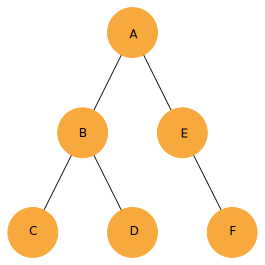

- [Description](#description)
- [Recursive depth first search](#recursive-depth-first-search)
- [Iterative depth first search](#iterative-depth-first-search)
- [Iterative depth first search with recursive-like order](#iterative-depth-first-search-with-recursive-like-order)

## Description

Given the following graph:

  

Represented by the following javascript data structure:

```javascript

const graph = {
  a: ["b", "e"],
  b: ["c", "d"],
  c: [],
  d: [],
  e: ["f"],
  f: [],
};
```

Three possible way could be used to iterate through its nodes. They are explained below.

## Recursive depth first search

In `index.js` one can find the function `recursiveDFS`.  
Given a `graph` parameter it will iterate over its nodes by using recursion and returns an array representing the
iteration order.  
The function called in the following way:

```javascript
recursiveDFS(graph);
```

Will have the following returned value:

```javascript
['a', 'b', 'c', 'd', 'e', 'f']
```

## Iterative depth first search

In `index.js` one can find the function `iterativeDFS`.  
Given a `graph` parameter it will iterate over its nodes by using iteration and returns an array representing the
iteration order.  
The function called in the following way:

```javascript
iterativeDFS(graph);
```

Will have the following returned value:

```javascript
['a', 'e', 'f', 'b', 'd', 'c']
```

## Iterative depth first search with recursive-like order

In `index.js` one can find the function `orderedIterativeDFS`.  
Given a `graph` parameter it will iterate over its nodes by using iteration and returns an array representing the
iteration order.  
The difference between `iterativeDFS` and `orderedIterativeDFS` is that the `orderedIterativeDFS` **iterate over the
nodes in the same order as** `recursiveDFS`.  
The function called in the following way:

```javascript
orderedIterativeDFS(graph);
```

Will have the following returned value:

```javascript
['a', 'b', 'c', 'd', 'e', 'f']
```
